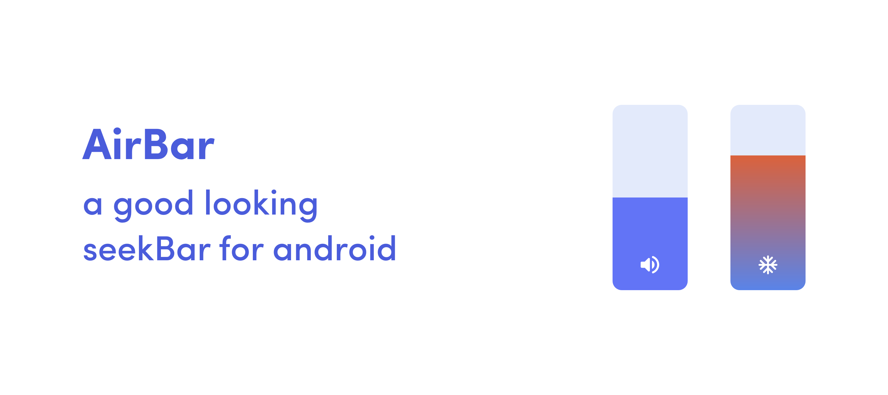

# AirBar
<p align="center"></p>

[](https://www.android.com)
[](https://android-arsenal.com/api?level=21)

# Usage
``` 
allprojects {
		repositories {
			...
			maven { url 'https://jitpack.io' }
		}
	}
  ```
```
dependencies {
		implementation 'com.github.5hahryar:AirBar:1.0.0'
	}
  ```
  
  ### XML
  ```
  <com.shahryar.airbar.AirBar
        android:id="@+id/airbar"
        android:layout_width="70dp"
        android:layout_height="200dp"
        android:clickable="true"
        android:focusable="true" />
  ```
  
  ### Listener
  ```
  override fun onCreate(savedInstanceState: Bundle?) {
        super.onCreate(savedInstanceState)
        setContentView(R.layout.activity_main)

        airbar.listener = this
    }


  override fun onLevelChanged(level: Int, progress: Double) {
       //Do stuff
    }
  ```
  
  # Attributes
  Attribute | Functionality
  ------------ | ------------- 
  levelFillColor | Set color for level indicator
  backgroundSurfaceColor | Set background color
  backgroundCornerRadius | Set corner radius 
  icon | Set icon
  levelGradientColor0 | Set gradient color for bottom of the view
  levelGradientColor1 | Set gradient color for top of the view
  max | Set Maximum value 
  min | Set minimum value
  
  # License
  AirBar is licensed under `MIT license`. View [license](LICENSE).
